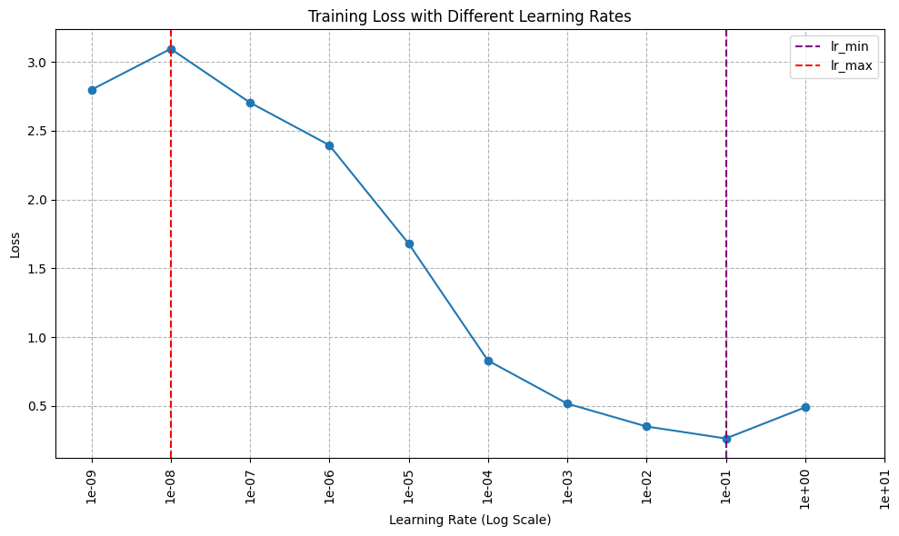
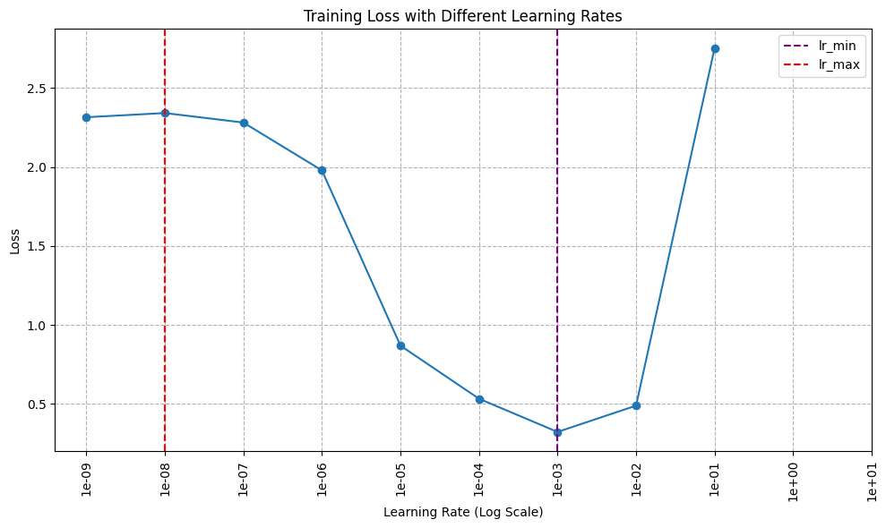
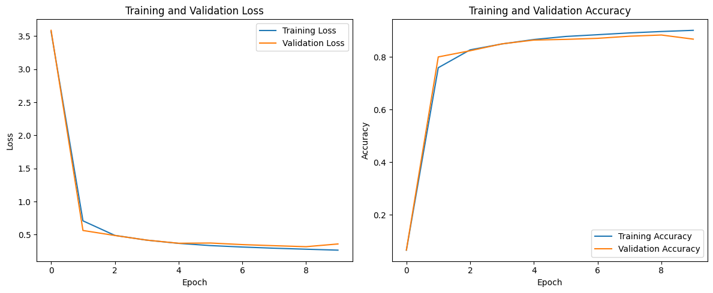
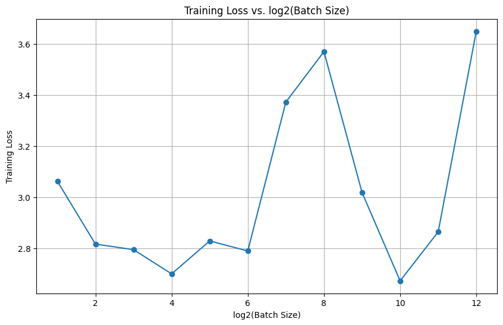
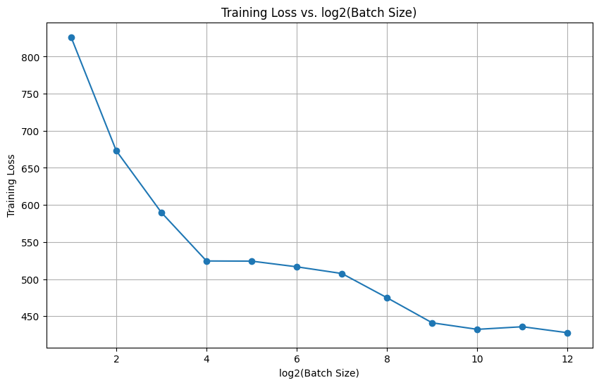

# CNN Training on Fashion MNIST

This project explores the impact of Batch Normalization, optimizers, learning rates, and batch sizes on CNN performance using the Fashion MNIST dataset.

## Methods
- CNN with Conv2D, AveragePooling2D, Dense layers
- Batch Normalization & Standard Normalization
- Optimizers: SGD and Adam
- Learning Rate Finder
- Batch Size Experimentation

## Results & Observations
- Larger batch sizes reduce steps per epoch but don't guarantee lower loss.
- Batch Normalization with SGD behaves differently compared to Adam optimizer.

## Visualizations

**Batch Normalization + SGD Optimizer**

The plot above demonstrates how the **training loss** changes with different learning rates when using **Batch Normalization** combined with the **SGD optimizer**.

#### **Observation**
As the learning rate increases, the loss decreases significantly and reaches its minimum when the learning rate approaches:

$$
1 \times 10^{-1}
$$

At this point, we observe both the **lowest training loss** and the **highest accuracy** during the training process.

#### **Note on Numerical Instability**
The loss value for:

$$
10^{1} \quad (\text{i.e., } 10e1)
$$

is not displayed due to **numerical instability**.

When using a **high learning rate** in combination with **Batch Normalization**, the scale (\( \gamma \)) and shift (\( \beta \)) parameters can be updated too aggressively. This excessive adjustment amplifies the activations throughout the network layers, leading to what's known as **exploding activations**. As a result, the network outputs diverge, causing the loss to become:

loss = NaN

This behavior highlights the importance of carefully tuning the learning rate when Batch Normalization is involved.

#### **Conclusion**
The optimal learning rate
$$
\( lr_{\text{min}} \)
$$
for this configuration is approximately:

lr_min ≈ 1e-1

This aligns with the principles of gradient descent, where parameter updates follow:

$$
\theta_{t+1} = \theta_t - \eta \cdot \nabla L(\theta_t)
$$

Where:
- \( \theta \) = Model parameters  
- \( \eta \) = Learning rate  
- \( \nabla L(\theta_t) \) = Gradient of the loss function  

Choosing:

$$
\eta \approx 1 \times 10^{-1}
$$

ensures **fast convergence** while avoiding instability due to overly large updates.

Note that the validation loss and accuracy don't always follow the training loss and accuracy. For instance, in the 5th epoch, even though the training loss decreased compared to the 4th epoch, the validation loss increased. This is a sign that the model might be starting to overfit to the training data.

From the runtime data, we observe that as the batch size increases, the number of iterations per epoch decreases. Smaller batch sizes tend to have noisier updates; Larger batch sizes provide more stable gradient updates but might converge to sharp minima. However, there is little imformation we can conclude from the graph. The flctuation in training loss increases as batch size increases, potentially due to the tendency of converging to local minima.

As the batch size increases, the number of steps per epoch decreases. This is expected since the batch size is inversely proportional to the number of steps per epoch. However, the loss doesn't show a consistent trend with increasing batch size, and it seems to be converging to a high loss. The result is very different from the other model that uses bn input and sgd optimization.

